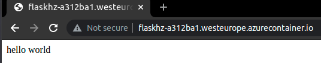
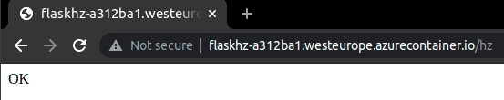

# Simple Flask App

```
$ make

Usage:
  make <target>

Targets:
  docker-build     Build docker image
  docker-run       Run docker
  docker-stop      Stop docker
  az-rg            Create the Azure Resource Group (az login first)
  az-rg-del        Delete the Azure Resource Group
  az-aci           Run app (Azure Container Instance)
  az-aci-fqdn      Get app FQDN
  az-aci-logs      Get app logs (Azure Container Instance)
  az-aci-delete    Delete app (Azure Container Instance)
```

### # Azure ACI

```
az login
make az-rg
make az-aci
```



